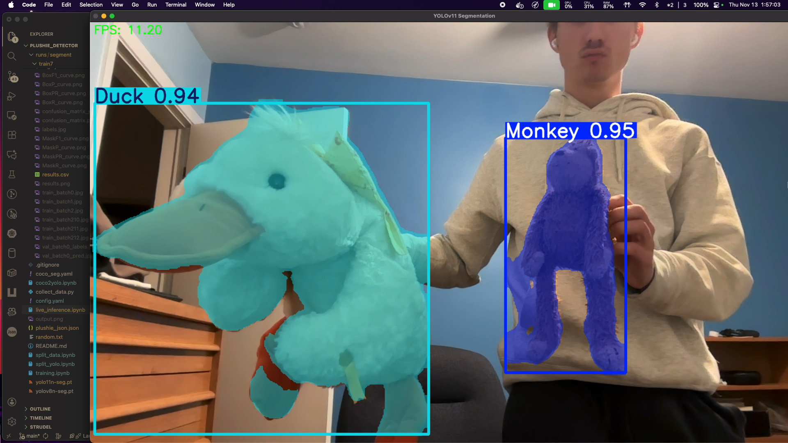
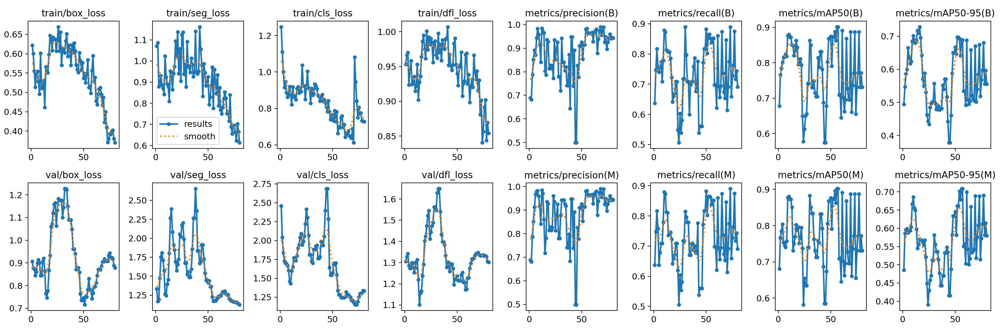

# plushie_detector
Trained a YOLO model to detect different plushies by creating my own custom labelled dataset in label studio. I then exported the dataset as a coco dataset, and converted it to YOLO format, split the images into train/val sets with a custom function, and trained a model locally on my macbook using Metal Performance Shaders (MPS) for GPU acceleration. After training for a total of over 130 epochs, with YOLO's default data augmentation, I found that more data would likely improve performance because the validation set does not improve significantly with more training, while the training set loss consistently decreases; whereas training further with the current data would just lead to overfitting.

An example of segmentation inference of my model.

Training curves

Sample training batch with transformations:

